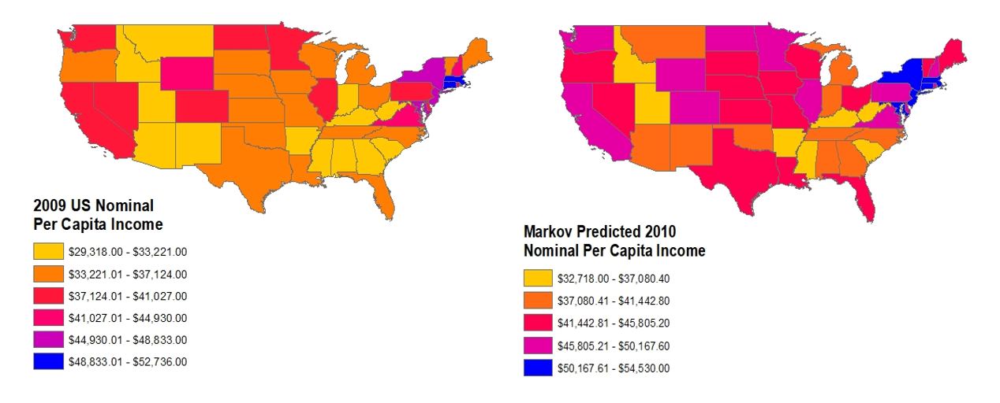
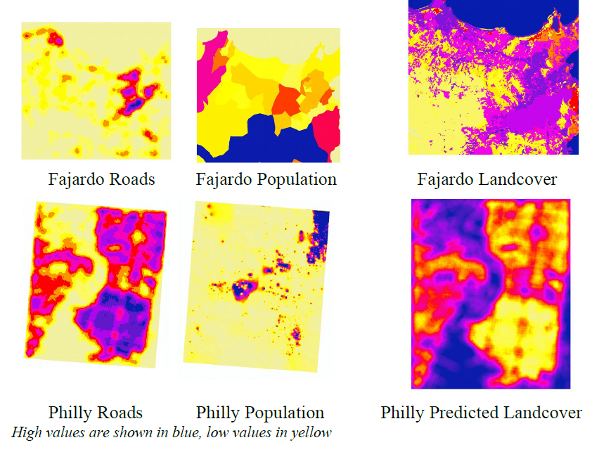

# Custom Data Science Tools for ArcGIS

This repository contains custom ArcPy tools that I've built. These are Python scripts that can be uploaded as data-agnostic geoprocessing tools into the ArcGIS Desktop software. The tools are implemented  as pure functions in ArcGIS, requiring specific spatial data inputs in order to produce results. 

### List of Tools:

#### MarkovChainAnalysis.py

This is a tool that will perform a simple non-spatial Markov Chain Analysis on the attribute table of an ArcGIS feature class. The feature class must have multiple time fields. For example, a feature class of US counties could have multiple fields named by year (2001, 2002, 2003) filled with county population counts for each year. The tool discretizes the change in each record over time into a given time interval and calculates probabilities of each state transition into a transition matrix. This matrix is used to create a new field containing predicted values in the future based on the time interval.

 

#### MultipleOLSRegression_RasterPrediction.py

This is a tool that will calculate OLS Regression on the cell values of given independent raster dataset(s) amd a given dependent raster dataset. The tool will then apply the regression equation on a separate given independent raster dataset(s) to make predictions. For example, given rasters for landcover, population, and household income for City A, the tool will calculate the regression equation (Y = bX1 + bX2) on the correlation between both landcover (X1) and population (X2) and household income (Y). Then, given rasters for landcover and population for City B, the tool will predict household income for City B.

 
